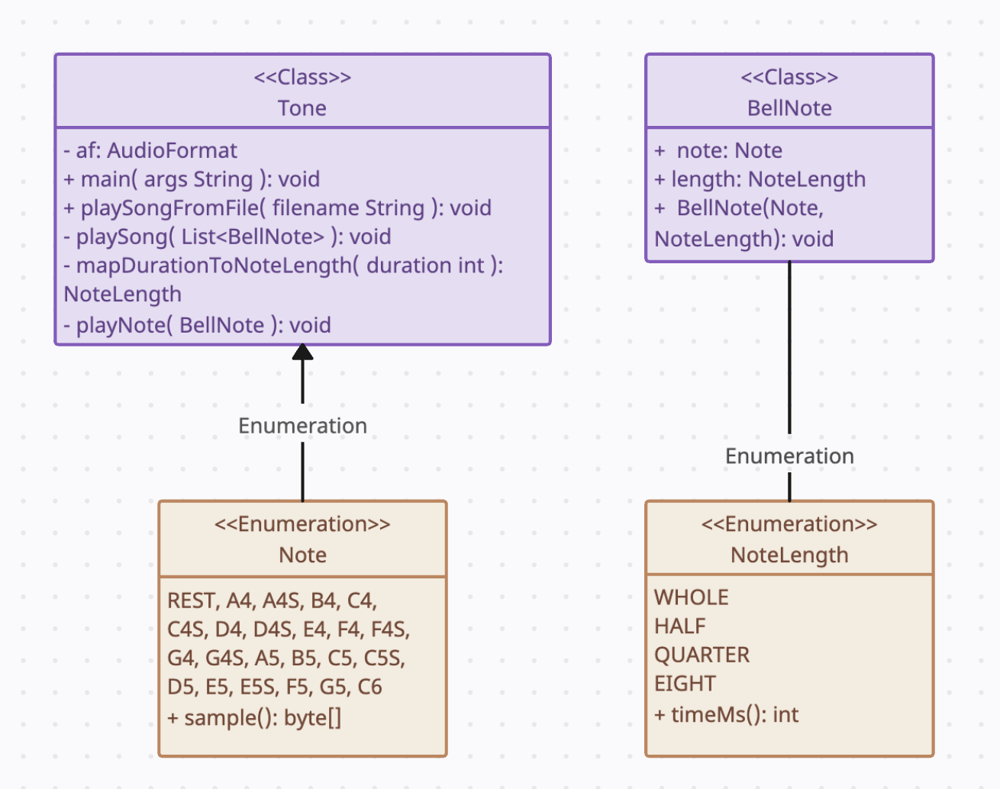

# Bell Choir

The following lab will play any given song. This uses multithreaded processing in order to assign notes to bells. The
following documentation will guide the user on how to run the program.

## Processing Description

There were many challenges faced while developing this lab. The biggest challenge that I encountered was that once I
introduced threads into my program, the notes would all play at the same time. So to fix this bug, I needed to add a
stagger so that the threads would sleep at the right time and be awoken once needed, thus eliminating the overlapping
problem.

This program meets the requirements by using multithreading in order to play notes. There's a conductor thread pool that
controls the notes being played and ensures that the music stays in time and in key. This lab also contains excellent
documentation and many comments throughout in order to guide the user and developer through the code and run process.

## To Run the Application

This application can be run using Ant. To run, please follow these direction.

Open the terminal application of your choice (terminal on MacOS, command line on Windows, etc.)

Enter the following commands:

a. Navigate to the root folder where you'd like these files to go:

Example: `cd Desktop`

b. Clone the git repository to your computer:

`git clone https://github.com/abbyymaureen/Tone.git`

c. To compile and create a JAR file:

`ant jar`

d. To run the jar file:

`ant run`

e. To run the jar file with arguments (specified file):

`ant run -Dsong=songs/mary.txt`

e. To clean up the terminal and remove build artifacts:

`ant clean`

## References

* ChatGPT - Found the error where notes would overlap, along with not taking in command line arguments.
* Nathan Williams -Tone files provided, helped to create an excellent boilerplate.